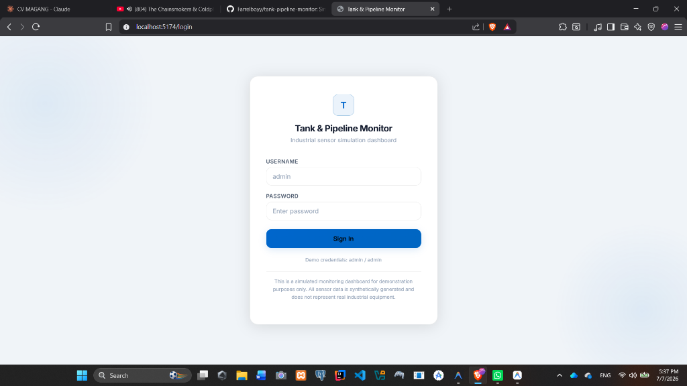
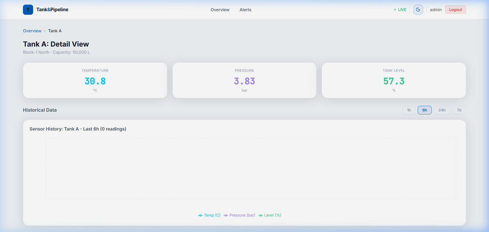
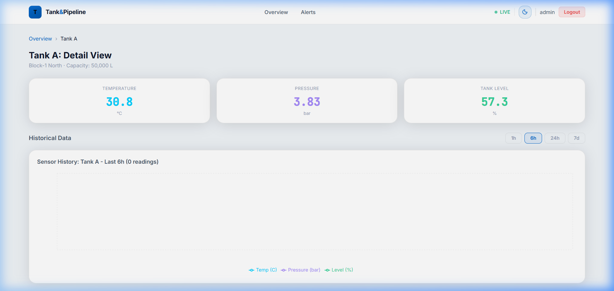

# Tank & Pipeline Monitoring Dashboard

A full-stack web application that simulates real-time sensor monitoring for oil and gas storage tanks and pipelines. Built as a portfolio project to demonstrate end-to-end development covering backend API design, database management, data simulation, and modern frontend dashboard development.

The application generates synthetic sensor data every 5 seconds for five tanks, persists it to a local SQLite database, evaluates threshold rules to trigger alerts, and streams the data to a React dashboard via polling.

---

## Screenshots

### Dashboard Overview


### Tank Detail with Historical Chart


### Alerts Page


---

## Tech Stack

| Layer | Technology |
|---|---|
| Frontend | React 18, Vite, Recharts, React Router v6, Axios |
| Backend | Node.js, Express |
| Database | SQLite (via better-sqlite3) |
| Authentication | JSON Web Token (JWT) |
| Styling | Vanilla CSS with custom design tokens |

---

## Features

**Data Simulator**
- Generates sensor readings every 5 seconds for 5 tanks (Tank A through Tank E)
- Uses a random walk with mean reversion algorithm to produce smooth, realistic trends instead of purely random values
- Each reading includes temperature (Celsius), pressure (bar), and tank fill level (percent)
- Automatically evaluates threshold rules on each new reading and writes alerts to the database

**REST API**
- JWT-protected endpoints for tanks and alerts
- Historical data endpoint with date range filtering
- Single admin user authentication

**Dashboard**
- Overview page with live tank cards showing color-coded status (normal / warning / danger)
- Real-time chart updated every 5 seconds via polling
- Tank detail page with historical Recharts line chart and preset time range filters (1h, 6h, 24h, 7d)
- Alerts page listing all active threshold violations with severity badges
- Automatic token expiry handling with redirect to login

**Threshold Rules**

| Parameter | Condition | Severity |
|---|---|---|
| Temperature | Below 15 C or above 40 C | Warning |
| Pressure | Above 5 bar | Danger |
| Tank Level | Below 10% or above 95% | Warning |

---

## Project Structure

```
tank-pipeline-monitor/
|
|-- backend/
|   |-- migrations/
|   |   `-- init.js             # Creates tables and seeds initial data
|   |-- src/
|   |   |-- config/
|   |   |   `-- database.js     # SQLite connection (WAL mode, singleton)
|   |   |-- controllers/
|   |   |   |-- authController.js
|   |   |   |-- tankController.js
|   |   |   `-- alertController.js
|   |   |-- middleware/
|   |   |   `-- authMiddleware.js
|   |   |-- routes/
|   |   |   |-- auth.js
|   |   |   |-- tanks.js
|   |   |   `-- alerts.js
|   |   `-- services/
|   |       `-- dataSimulator.js  # Core simulation engine
|   |-- .env.example
|   |-- package.json
|   `-- server.js
|
`-- frontend/
    |-- src/
    |   |-- components/
    |   |   |-- Navbar.jsx
    |   |   |-- ProtectedRoute.jsx
    |   |   |-- RealtimeChart.jsx
    |   |   `-- TankCard.jsx
    |   |-- context/
    |   |   `-- AuthContext.jsx
    |   |-- pages/
    |   |   |-- AlertsPage.jsx
    |   |   |-- DashboardPage.jsx
    |   |   |-- LoginPage.jsx
    |   |   `-- TankDetailPage.jsx
    |   |-- services/
    |   |   `-- api.js
    |   |-- App.jsx
    |   |-- index.css
    |   `-- main.jsx
    |-- index.html
    |-- package.json
    `-- vite.config.js
```

---

## Getting Started

### Prerequisites

- Node.js 18 or higher
- npm 9 or higher

### Installation

**1. Clone the repository**

```bash
git clone https://github.com/your-username/tank-pipeline-monitor.git
cd tank-pipeline-monitor
```

**2. Set up the backend**

```bash
cd backend
npm install
```

Copy the example environment file and adjust if needed:

```bash
cp .env.example .env
```

Run the database migration to create tables and seed initial data:

```bash
npm run migrate
```

**3. Set up the frontend**

```bash
cd ../frontend
npm install
```

### Running the Application

Open two separate terminal windows.

**Terminal 1 — Backend**

```bash
cd backend
npm run dev
```

The API server will start at `http://localhost:3001`. The data simulator begins immediately on startup.

**Terminal 2 — Frontend**

```bash
cd frontend
npm run dev
```

The frontend will start at `http://localhost:5173`.

Open your browser and navigate to `http://localhost:5173`. Use the credentials below to sign in.

---

## Default Credentials

| Field | Value |
|---|---|
| Username | admin |
| Password | admin |

> **Note:** These default credentials are for demonstration purposes only and should never be used in a production environment.

---

## Environment Variables

The `backend/.env` file accepts the following variables:

| Variable | Default | Description |
|---|---|---|
| PORT | 3001 | Port the Express server listens on |
| JWT_SECRET | (see .env.example) | Secret key used to sign JWT tokens |
| NODE_ENV | development | Runtime environment |

---

## API Endpoints

All endpoints except `/api/auth/login` require a Bearer token in the `Authorization` header.

| Method | Path | Description |
|---|---|---|
| POST | /api/auth/login | Authenticate and receive a JWT |
| GET | /api/tanks | List all tanks with their latest sensor reading |
| GET | /api/tanks/:id/current | Get a single tank with its most recent reading |
| GET | /api/tanks/:id/history | Get historical readings with optional `from` and `to` query params |
| GET | /api/alerts | List all active (unresolved) threshold alerts |
| GET | /api/health | Server health check (no auth required) |

**Example: login request**

```bash
curl -X POST http://localhost:3001/api/auth/login \
  -H "Content-Type: application/json" \
  -d '{"username":"admin","password":"admin"}'
```

**Example: fetch all tanks**

```bash
curl http://localhost:3001/api/tanks \
  -H "Authorization: Bearer <your_token>"
```

---

## How the Simulator Works

The data simulator (`backend/src/services/dataSimulator.js`) runs on a 5-second interval and updates all five tanks in a single SQLite transaction.

Each sensor value evolves using the following formula:

```
new_value = current
          + (target - current) * mean_reversion_rate
          + (Math.random() - 0.5) * step_size * 2
```

The mean reversion component gently pulls values back toward a defined target (for example, 28 C for temperature) whenever they drift too far. The noise term adds realistic short-term variation. Values are clamped to physical limits to prevent simulation drift.

After each batch of readings is written, the simulator evaluates threshold rules and inserts rows into the `alerts` table for any violations.

---

## Database Schema

```sql
users (
  id            INTEGER PRIMARY KEY,
  username      TEXT UNIQUE NOT NULL,
  password_hash TEXT NOT NULL,
  created_at    DATETIME
)

tanks (
  id               INTEGER PRIMARY KEY,
  name             TEXT NOT NULL,
  location         TEXT NOT NULL,
  capacity_liters  REAL NOT NULL
)

sensor_readings (
  id             INTEGER PRIMARY KEY,
  tank_id        INTEGER REFERENCES tanks(id),
  temperature    REAL,
  pressure       REAL,
  level_percent  REAL,
  recorded_at    DATETIME
)

alerts (
  id          INTEGER PRIMARY KEY,
  tank_id     INTEGER REFERENCES tanks(id),
  parameter   TEXT,
  value       REAL,
  threshold   REAL,
  severity    TEXT CHECK(severity IN ('warning', 'danger')),
  created_at  DATETIME,
  resolved_at DATETIME
)
```

---

## License

This project is intended for portfolio and educational purposes.
